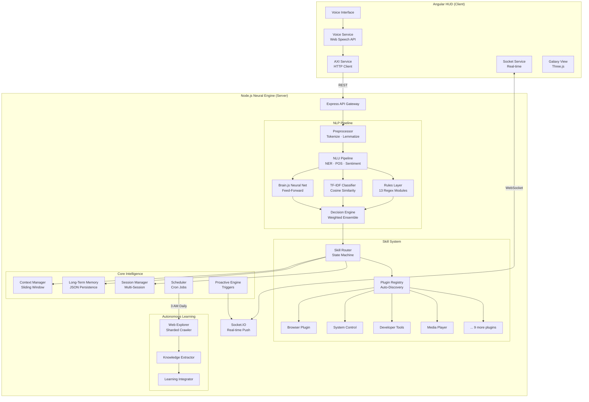
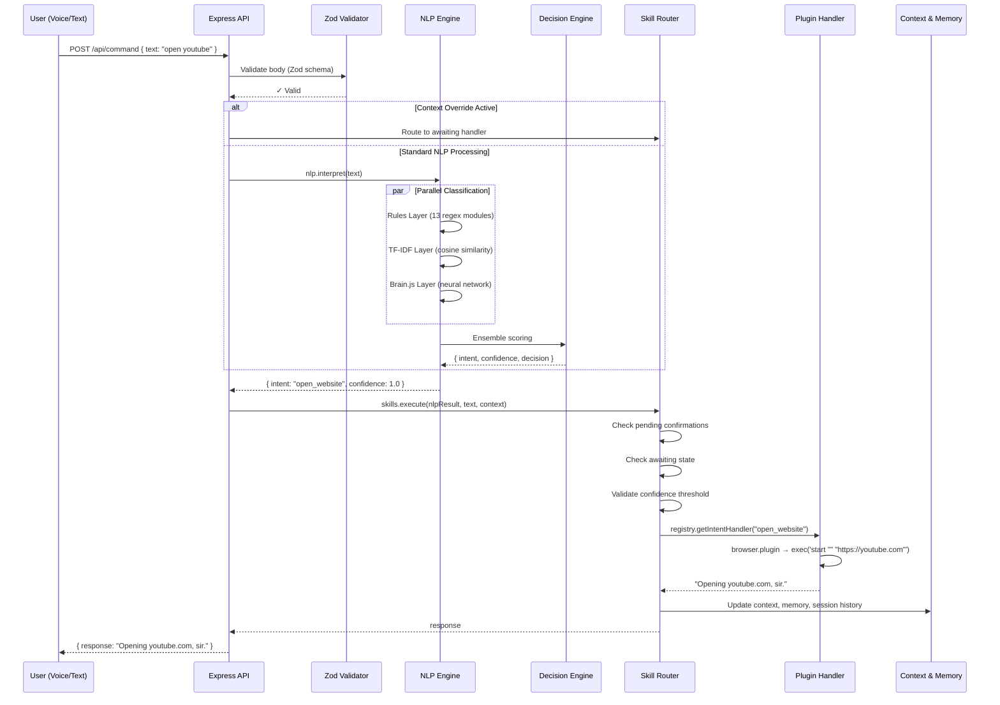

# 🧠 AXI — Advanced Cybernetic Intelligence

> A fully self-contained voice assistant with a hybrid NLP engine, autonomous learning, and a futuristic HUD interface — zero reliance on external LLMs.


AXI is an AI voice assistant that processes every command through its own NLP pipeline — combining deterministic regex rules, a TF-IDF cosine similarity classifier, and a Brain.js neural network into a single weighted ensemble. Unlike cloud-dependent assistants, AXI runs entirely on your machine and improves itself nightly through an autonomous web-crawling learning cycle. The Angular HUD frontend provides a sci-fi-grade interface with voice recognition, real-time WebSocket notifications, and a Three.js galaxy visualization.

---

## 🚀 Live Demo

| Layer | URL |
|-------|-----|
| **Frontend** | [siddharth971.github.io/AXI](https://siddharth971.github.io/AXI/) |
| **Backend API** | [axi-660w.onrender.com](https://axi-660w.onrender.com) |

---

## Table of Contents

- [Architecture](#architecture)
- [Project Structure](#project-structure)
- [How It Works](#how-it-works)
- [Features](#features)
- [Installation & Setup](#installation--setup)
- [API Reference](#api-reference)
- [Configuration](#configuration)
- [Tech Stack](#tech-stack)
- [Testing](#testing)
- [Deployment](#deployment)
- [Contributing](#contributing)
- [Roadmap](#roadmap)
- [License & Credits](#license--credits)

---

## Architecture

AXI is a monorepo with two primary subsystems: a **Node.js Neural Engine** (backend) and an **Angular HUD** (frontend), connected via REST API and WebSockets.



### Core Components

| Component | Responsibility |
|-----------|---------------|
| **NLP Pipeline** | 5-stage text processing: preprocessing → NLU → rules/TF-IDF/neural → ensemble scoring → dispatch |
| **Decision Engine** | Merges 3 classifier signals with weighted scoring (Rules 55%, TF-IDF 30%, Neural 15%) and gates on confidence thresholds |
| **Plugin Registry** | Auto-discovers `*.plugin.js` files, validates contracts, builds intent→handler map |
| **Skill Router** | Stateful execution engine with confirmation flows, context awareness, and sentiment fallback |
| **Context Store** | Short-term memory (5 interactions, 5-min TTL) for pronoun resolution and follow-up detection |
| **Autonomous Explorer** | Sharded web crawler generating structured "blueprints" for self-training |
| **Proactive Engine** | Trigger-based system (morning briefing, health checks) pushing unsolicited notifications |

### Design Patterns

- **Singleton Services** — Socket.IO, Registry, Scheduler, Memory are global singletons
- **Middleware-First** — Zod schema validation on all POST routes
- **Plugin Architecture** — Skills are isolated, hot-reloadable modules with enforced contracts
- **State Machine** — Router manages confirmation flows and context-awaiting states
- **Ensemble Learning** — Three independent classifiers produce a fused confidence score

---

## Project Structure

```
AXI/
├── client/                              # ── Angular 20 HUD Frontend ──
│   ├── src/
│   │   ├── app/
│   │   │   ├── components/
│   │   │   │   ├── axi-interface/       # Main voice assistant HUD (default route)
│   │   │   │   ├── axi-interface-3d/    # Three.js 3D neural interface
│   │   │   │   ├── chat/                # Chat message renderer
│   │   │   │   ├── core/                # Shared UI primitives
│   │   │   │   ├── dashboard/           # System dashboard (/dashboard)
│   │   │   │   ├── galaxy-view/         # 3D galaxy visualization (/galaxy)
│   │   │   │   └── skills/              # Skill card components
│   │   │   ├── services/
│   │   │   │   ├── axi.service.ts       # REST API client
│   │   │   │   ├── voice.service.ts     # Web Speech API integration
│   │   │   │   ├── socket.service.ts    # Socket.IO client
│   │   │   │   └── skill-context.service.ts
│   │   │   ├── app.ts                   # Root component
│   │   │   └── app.routes.ts            # Route definitions
│   │   ├── assets/                      # Static: sounds, icons
│   │   └── styles.scss                  # Global styles
│   ├── angular.json
│   └── package.json
│
├── server/                              # ── Node.js Neural Engine ──
│   ├── app.js                           # Entry point (Express + Socket.IO)
│   ├── config/
│   │   └── index.js                     # Centralized config & system prompt
│   │
│   ├── nlp/                             # Natural Language Processing
│   │   ├── nlp.js                       # Hybrid NLP engine (interpret/interpretMulti)
│   │   ├── nlu-pipeline.js              # NLU orchestration (NER + POS + signals)
│   │   ├── preprocessor.js              # Tokenize, stopwords, lemmatize
│   │   ├── entity-extractor.js          # compromise.js NER + custom slots
│   │   ├── context-store.js             # Short-term conversational memory
│   │   ├── decision-engine.js           # Weighted ensemble scorer
│   │   ├── tfidf-classifier.js          # TF-IDF cosine similarity (zero-dep)
│   │   ├── train.js                     # Brain.js neural network trainer
│   │   ├── train-tfidf.js               # TF-IDF model trainer
│   │   ├── learn.js                     # Autonomous learning integrator
│   │   ├── learning-monitor.js          # Unknown/low-confidence tracker
│   │   ├── intent-loader.js             # Intent JSON file loader
│   │   ├── rule-loader.js               # Rule module loader
│   │   ├── intents/                     # 24 training datasets (JSON)
│   │   ├── rules/                       # 13 regex rule modules
│   │   └── semantic/                    # Vector embeddings subsystem
│   │       ├── embedder.js              # Text → vector encoder
│   │       ├── similarity.js            # Cosine similarity math
│   │       ├── generate-vectors.js      # Intent vector generator
│   │       └── intent-vectors.json      # Pre-computed vectors (~37 MB)
│   │
│   ├── skills/                          # Skill & Plugin System
│   │   ├── registry.js                  # Auto-discovery & contract validation
│   │   ├── router.js                    # Stateful execution router
│   │   ├── knowledge-handler.js         # RAG knowledge serving
│   │   ├── plugins/                     # 13 auto-loaded plugin modules
│   │   │   ├── browser.plugin.js        # Web navigation & tabs
│   │   │   ├── system_control.plugin.js # Volume, brightness, lock
│   │   │   ├── developer.plugin.js      # Git, NPM, terminal
│   │   │   ├── file.plugin.js           # File system (CRUD)
│   │   │   ├── media.plugin.js          # Media playback
│   │   │   ├── system.plugin.js         # System info & management
│   │   │   ├── memory.plugin.js         # Remember / recall facts
│   │   │   ├── learning.plugin.js       # Correction & feedback
│   │   │   ├── knowledge.plugin.js      # Knowledge base queries
│   │   │   ├── realtime-knowledge.plugin.js # DuckDuckGo live search
│   │   │   ├── conversational.plugin.js # Emotional / small-talk
│   │   │   ├── communication.plugin.js  # Email / messaging
│   │   │   └── productivity.plugin.js   # Reminders, notes, timers
│   │   ├── handlers/                    # Lower-level handler logic
│   │   └── responses/
│   │       └── fallback.js              # Unknown / error response templates
│   │
│   ├── core/                            # Core Intelligence
│   │   ├── context.js                   # Request-level context (sliding window)
│   │   ├── memory.js                    # Persistent fact store (JSON)
│   │   ├── sessions.js                  # Multi-session management
│   │   ├── socket.js                    # Socket.IO singleton
│   │   ├── proactive.js                 # Trigger-based notification engine
│   │   ├── scheduler.js                 # Cron job manager
│   │   ├── learning.js                  # Correction persistence
│   │   ├── knowledge-lookup.js          # DuckDuckGo query API
│   │   └── web-search.js               # Web search abstraction
│   │
│   ├── autonomous/                      # Self-Learning System
│   │   ├── explorer.mjs                 # Sharded web crawler (50 concurrent)
│   │   ├── extract.js                   # Knowledge extraction pipeline
│   │   ├── discover.js                  # Domain discovery
│   │   ├── domains.json                 # Target URL registry
│   │   └── output/                      # Crawled blueprint files
│   │
│   ├── triggers/                        # Proactive triggers
│   │   ├── morning-briefing.js          # Daily morning fact
│   │   └── system-health.js             # Memory usage monitor
│   │
│   ├── data/                            # Persistent data
│   │   ├── memory.json                  # Long-term facts
│   │   ├── corrections.json             # User correction log
│   │   ├── tfidf-model.json             # Trained TF-IDF model
│   │   └── models/model-tf/             # Brain.js neural model
│   │
│   ├── tests/                           # 200+ integration tests
│   ├── scripts/                         # Build & data scripts
│   ├── docs/                            # Architecture docs
│   ├── utils/                           # Logger, validator, loader
│   ├── Dockerfile                       # Docker config (Node 20)
│   └── package.json
│
├── .github/workflows/                   # CI/CD (GitHub Actions)
└── README.md
```

---

## How It Works

### 1. Entry Point

The server boots in `app.js` via an async IIFE that initializes subsystems in order:

```
proactive.init() → scheduler.init() → socket.init(server)
→ await initTFIDF() → await skills.initialize() → server.listen(5000)
```

### 2. Request Lifecycle



### 3. NLP Processing Pipeline

Every user input passes through 5 stages:

| Stage | Module | What Happens |
|-------|--------|-------------|
| **1. Preprocessing** | `preprocessor.js` | Lowercase → strip punctuation → remove stopwords (preserve negations) → lemmatize |
| **2. NLU Analysis** | `nlu-pipeline.js` | Extract entities (NER), POS tags, signals (question type, sentiment, command detection) |
| **3. Rule Matching** | `rules/*.js` | Match against 13 domain-specific regex modules — highest priority |
| **4. ML Classification** | `tfidf-classifier.js` + `brain.js` | TF-IDF cosine similarity + neural network soft predictions |
| **5. Ensemble Scoring** | `decision-engine.js` | `score = rules×0.55 + tfidf×0.30 + neural×0.15` → gate by threshold |

### 4. Confidence Gate

| Ensemble Score | Decision | Behavior |
|---------------|----------|----------|
| `≥ 0.72` | **EXECUTE** | Dispatch to skill handler |
| `0.50 – 0.71` | **CLARIFY** | "Did you mean X or Y?" |
| `< 0.50` | **UNKNOWN** | "I didn't quite catch that." |
| Any + non-neutral sentiment | **EMOTIONAL** | Route to conversational handler |

### 5. Error Handling

- **Zod validation** — Rejects malformed requests with `400` + structured error details
- **Plugin contract validation** — Plugins missing required fields throw on boot, not runtime
- **Fallback responses** — 5 rotating response templates per error category (unknown, low-confidence, error, plugin-not-found)
- **Knowledge lookup fallback** — Unknown intents that look like factual questions trigger a DuckDuckGo lookup before falling back
- **Confirmation timeout** — Pending destructive actions auto-expire after 30 seconds

---

## Features

| Feature | Description | Status |
|---------|-------------|--------|
| **🧠 Hybrid NLP Engine** | 3-layer classifier ensemble (Rules + TF-IDF + Neural) with weighted scoring | ✅ Stable |
| **🎤 Voice Control** | Web Speech API for speak-to-command with continuous listening | ✅ Stable |
| **🔌 Plugin System** | 13 auto-discovered, hot-reloadable skill plugins with enforced contracts | ✅ Stable |
| **🌐 Browser Automation** | Open websites, manage tabs, scroll, screenshot, incognito mode | ✅ Stable |
| **💻 System Control** | Volume, brightness, lock screen, app launcher, shutdown/restart | ✅ Stable |
| **📁 File Operations** | Create, delete, list, move, rename files and folders with safe paths | ✅ Stable |
| **🎵 Media Playback** | Play/pause/next/previous, Spotify integration, YouTube search | ✅ Stable |
| **🧰 Developer Tools** | Git status, npm install, terminal commands, VS Code launcher | ✅ Stable |
| **🧠 Long-Term Memory** | Persistent fact store — remember/recall/forget user facts (JSON‑backed) | ✅ Stable |
| **💬 Context Awareness** | Pronouns ("it", "that"), follow-ups ("louder"), conversation continuity | ✅ Stable |
| **🔄 Multi-Intent** | Compound commands: "Open YouTube **and** play lofi music" split & processed independently | ✅ Stable |
| **⚡ Real-Time Updates** | Socket.IO push notifications for proactive triggers | ✅ Stable |
| **🕐 Proactive Engine** | Scheduled triggers — morning briefing, system health alerts | ✅ Stable |
| **🤖 Autonomous Learning** | Nightly web crawler → knowledge extraction → self-retraining | ✅ Stable |
| **📊 TF-IDF Classifier** | Zero-dependency, explainable, negation-preserving text classifier | ✅ Stable |
| **🛡️ Safety System** | Destructive actions require confirmation; blocked file system paths | ✅ Stable |
| **📡 Live Web Search** | DuckDuckGo fallback for unknown factual questions | ✅ Stable |
| **🎭 Sentiment Routing** | Emotional inputs ("I'm feeling sad") trigger empathetic responses | ✅ Stable |
| **📋 Session Management** | Multi-session conversations with auto-titling | ✅ Stable |
| **🌌 Galaxy Visualization** | Three.js 3D galaxy view of the neural network | ✅ Stable |
| **🔧 Self-Correction** | User says "that's wrong" → correction logged → injected into next training cycle | ✅ Stable |

### Voice Command Examples

```bash
# Browser
"Open YouTube"
"Search Google for climate change"
"Close this tab"
"Open GitHub in incognito"

# System
"Turn the volume up"
"Take a screenshot"
"Lock the screen"
"What's my battery status?"

# Media
"Play some lofi music"
"Pause"
"Next track"

# Developer
"Run git status"
"Open VS Code"

# Memory
"Remember my wifi password is abc123"
"What's my wifi password?"
"Forget my wifi password"

# General
"What time is it?"
"Tell me a fact about space"
"Hello!"
```

---

## Installation & Setup

### Prerequisites

| Requirement | Version | Note |
|-------------|---------|------|
| **Node.js** | ≥ 20.x | Required for both client and server |
| **npm** | ≥ 9.x | Comes with Node.js |
| **Git** | Any | For cloning |
| **Angular CLI** | ≥ 20.x | `npm install -g @angular/cli` (frontend only) |

### Quick Start

```bash
# 1. Clone the repository
git clone https://github.com/siddharth971/AXI.git
cd AXI

# 2. Install & start the backend
cd server
npm install
npm run train          # Train Brain.js neural network
npm run train:tfidf    # Train TF-IDF classifier
npm start              # Start server on port 5000

# 3. Install & start the frontend (new terminal)
cd ../client
npm install
ng serve               # Start Angular dev server on port 4200
```

### Development Mode

```bash
# Server with auto-reload (nodemon)
cd server
npm run dev

# Client with live-reload
cd client
npm start
```

### First-Time Training

The NLP models must be trained before AXI can classify intents:

```bash
cd server

# Option A: Train both classifiers
npm run train          # Brain.js (also runs learn step)
npm run train:tfidf    # TF-IDF cosine similarity

# Option B: Full pipeline including semantic vectors
npm run train
npm run train:tfidf
npm run generate:vectors
```

### Environment Variables

| Variable | Default | Required | Description |
|----------|---------|----------|-------------|
| `PORT` | `5000` | No | Server listening port |
| `NODE_ENV` | — | No | Set to `development` for plugin hot-reload |

> AXI is designed to be **zero-configuration**. All settings have sensible defaults in `server/config/index.js`.

---

## API Reference

**Base URL:** `http://localhost:5000/api`

### Core Endpoints

#### `POST /api/command`

Process a voice/text command through the NLP pipeline.

**Request:**
```json
{
  "text": "Open YouTube and play lofi music"
}
```

**Response:**
```json
{
  "response": "Opening youtube.com, sir."
}
```

**Validation:** `text` must be a non-empty string (max 1000 chars).  
**Errors:** `400` — Validation error | `500` — Internal server error

---

#### `GET /api/health`

Health check endpoint.

**Response:**
```json
{
  "status": "ok",
  "name": "AXI Server",
  "version": "1.0.0"
}
```

---

#### `GET /api/skill-context`

Returns dynamic data for the HUD side panel.

**Response:**
```json
{
  "items": [
    { "id": "weather", "type": "info", "icon": "cloud-sun", "title": "Weather", "value": "25°C, Sunny", "color": "cyan" },
    { "id": "time", "type": "info", "icon": "clock", "title": "Current Time", "value": "10:09 AM", "color": "purple" }
  ],
  "activeSkill": "open_website",
  "lastUpdated": "2026-04-01T04:30:00.000Z"
}
```

---

#### `GET /api/history`

Get conversation history for the current context.

**Response:**
```json
{
  "history": [
    { "input": "open youtube", "intent": "open_website", "response": "Opening youtube.com, sir." }
  ]
}
```

---

### Session Endpoints

| Method | Endpoint | Body | Description |
|--------|----------|------|-------------|
| `GET` | `/api/sessions` | — | List all sessions (newest first) |
| `POST` | `/api/sessions` | `{ "title": "Chat" }` | Create new session |
| `GET` | `/api/sessions/:id` | — | Get specific session by ID |
| `PUT` | `/api/sessions/:id` | `{ "title": "New Title" }` | Update session title |
| `DELETE` | `/api/sessions/:id` | — | Delete a session |
| `POST` | `/api/sessions/:id/activate` | — | Set as active session |

**Session Object:**
```json
{
  "id": "1711929600000",
  "title": "Open YouTube",
  "createdAt": "2026-04-01T04:00:00.000Z",
  "updatedAt": "2026-04-01T04:05:00.000Z",
  "messages": [
    { "userInput": "open youtube", "aiResponse": "Opening youtube.com, sir.", "timestamp": "..." }
  ]
}
```

---

### Memory & Learning Endpoints

| Method | Endpoint | Description |
|--------|----------|-------------|
| `GET` | `/api/memory` | Get all stored facts → `{ facts: [...] }` |
| `DELETE` | `/api/memory/:key` | Delete a specific fact |
| `GET` | `/api/learning` | Get pending corrections → `{ corrections: [...] }` |
| `GET` | `/api/knowledge` | List explored knowledge blueprints |
| `GET` | `/api/notifications` | Poll for proactive messages (clears queue on read) |

---

### Admin Endpoints

#### `POST /api/admin/cycle`

Manually trigger the autonomous learning cycle.

**Response:**
```json
{
  "success": true,
  "message": "Autonomous Cycle started",
  "status": "running"
}
```

**Errors:** `409` — Cycle already running

---

## Configuration

All configuration lives in [`server/config/index.js`](server/config/index.js) — a single file exporting an object.

### NLP Configuration

| Key | Value | Description |
|-----|-------|-------------|
| `NLP_CONFIDENCE_THRESHOLD` | `0.5` | Global minimum confidence for intent dispatch |

### Decision Engine Thresholds

| Key | Value | Description |
|-----|-------|-------------|
| `THRESHOLDS.EXECUTE` | `0.72` | Weighted score to execute immediately |
| `THRESHOLDS.CLARIFY` | `0.50` | Score range for clarification prompts |
| `WEIGHTS.rules` | `0.55` | Rules layer contribution |
| `WEIGHTS.tfidf` | `0.30` | TF-IDF layer contribution |
| `WEIGHTS.neural` | `0.15` | Neural layer contribution |

### Plugin Configuration

| Key | Value | Description |
|-----|-------|-------------|
| `PLUGINS.AUTO_LOAD` | `true` | Auto-discover plugins on startup |
| `PLUGINS.HOT_RELOAD` | `NODE_ENV === "development"` | Clear require cache before loading |
| `PLUGINS.CONFIRMATION_TIMEOUT` | `30000` | 30-second confirmation window |
| `PLUGINS.DEFAULT_CONFIDENCE` | `0.5` | Default per-intent threshold |

### Safety Configuration

| Key | Value | Description |
|-----|-------|-------------|
| `SAFETY.DESTRUCTIVE_INTENTS` | `["delete_file", "shutdown_system", ...]` | Intents requiring user confirmation |
| `SAFETY.BLOCKED_PATHS` | `["C:\\Windows", "/usr", ...]` | Protected file system paths |

### Feature Flags

| Key | Default | Description |
|-----|---------|-------------|
| `FEATURES.CONTEXT_ENABLED` | `true` | Enable context overrides (awaiting state) |
| `FEATURES.LOGGING_VERBOSE` | `true` | Debug-level logging |
| `FEATURES.PLUGINS_ENABLED` | `true` | Enable plugin system |
| `FEATURES.CONFIRMATION_FLOW` | `true` | Require confirmation for destructive actions |

### Website Mappings

```javascript
SITE_MAP: {
  "youtube": "https://youtube.com",
  "google": "https://google.com",
  "github": "https://github.com",
  "chatgpt": "https://chat.openai.com",
  // ... 14 total mapped sites
}
```

---

## Tech Stack

### Backend

| Layer | Technology | Version | Why |
|-------|-----------|---------|-----|
| **Runtime** | Node.js | 20.x | Fast, async I/O, JS ecosystem |
| **Framework** | Express | 5.1 | Minimal HTTP framework |
| **Real-time** | Socket.IO | 4.8 | Bi-directional WebSocket communication |
| **Neural Net** | Brain.js | 1.6 | Zero native-dependency JS neural network |
| **NER** | compromise.js | 14.14 | Lightweight NLP for entity extraction & POS tagging |
| **Validation** | Zod | 4.3 | Type-safe schema validation middleware |
| **Scheduling** | node-cron | 4.2 | Cron syntax for background jobs |
| **HTTP Client** | axios | 1.13 | External API requests (DuckDuckGo, etc.) |
| **ML (available)** | @tensorflow/tfjs | 4.22 | Future model upgrade path |
| **Screenshots** | screenshot-desktop | 1.15 | Native desktop screen capture |

### Frontend

| Layer | Technology | Version | Why |
|-------|-----------|---------|-----|
| **Framework** | Angular | 20.3 | Enterprise-grade SPA framework |
| **3D Graphics** | Three.js | 0.182 | Galaxy visualization & neural network rendering |
| **Angular-Three** | angular-three | 3.7 | Declarative Three.js in Angular templates |
| **Icons** | lucide-angular | 0.562 | Modern icon library |
| **State** | RxJS | 7.8 | Reactive streams for async data flows |
| **WebSocket** | socket.io-client | 4.8 | Real-time event reception |
| **Language** | TypeScript | 5.9 | Type safety at compile time |

### Infrastructure

| Layer | Technology | Why |
|-------|-----------|-----|
| **Containerization** | Docker (Node 20) | Reproducible deployments |
| **Frontend Hosting** | GitHub Pages | Free static hosting via GitHub Actions |
| **Backend Hosting** | Render | Free-tier Docker container hosting |
| **Persistence** | JSON file storage | Zero-setup, no database dependency |

---

## Testing

```bash
cd server

# Run the full test suite (200+ tests)
npm test

# Run all domain-specific test suites
node tests/run-all-tests.js

# Quick comprehensive check
node tests/comprehensive_check.js

# Validate dataset expansion
node tests/validate_expansion.js
```

### Test Coverage

| Domain | Tests | Description |
|--------|-------|-------------|
| Conversational | ✅ | Greetings, small talk, emotional routing |
| Browser Control | ✅ | Open/close/tab/scroll/screenshot |
| System Control | ✅ | Volume, brightness, lock, shutdown |
| Media | ✅ | Play, pause, next, Spotify |
| File System | ✅ | CRUD operations with safety checks |
| Developer Tools | ✅ | Git, npm, terminal |
| Knowledge | ✅ | Question answering, RAG |
| Memory | ✅ | Remember, recall, forget |
| NLP Pipeline | ✅ | Preprocessing, entity extraction, classification |
| Security | ✅ | Path blocking, input sanitization |

### Debugging Tools

```bash
# Trace NLU output for any command
node nlp/nlp.js --debug "open youtube and play music"

# Inspect TF-IDF classification with token weights
node -e "
  const { TFIDFClassifier } = require('./nlp/tfidf-classifier');
  const c = new TFIDFClassifier();
  c.load('./data/tfidf-model.json').then(() => {
    console.log(c.explain('play some music', 'play_music'));
  });
"

# Run dataset health check
node scripts/dataset-health.js

# Generate validation report
node nlp/validation-report.js
```

---

## Deployment

### Docker

```bash
cd server

# Build the container
docker build -t axi-server .

# Run with default settings
docker run -p 5000:5000 axi-server

# Run with custom port
docker run -p 8080:8080 -e PORT=8080 axi-server
```

**Dockerfile:**
```dockerfile
FROM node:20
WORKDIR /app
COPY package*.json ./
RUN npm ci
COPY . .
EXPOSE 5000
CMD ["npm", "start"]
```

### Frontend — GitHub Pages

The Angular frontend auto-deploys via GitHub Actions on push to `main`:

```bash
cd client
ng build --configuration production --base-href /AXI/
# Output: dist/ → deployed to GitHub Pages
```

**Live URL:** `https://siddharth971.github.io/AXI/`

### Backend — Render

1. Connect your GitHub repo to [Render](https://render.com)
2. Set **Build Command:** `npm ci`
3. Set **Start Command:** `npm start`
4. Set environment: `PORT=5000`
5. Deploy

**Live URL:** `https://axi-660w.onrender.com`

### CI/CD Pipeline

GitHub Actions workflow (`.github/workflows/`):
- **Frontend:** Build Angular → Deploy to GitHub Pages on push to `main`
- **Backend:** Docker build → Deploy to Render (via render.yaml or dashboard)

### NPM Scripts Reference

| Script | Command | Purpose |
|--------|---------|---------|
| `dev` | `nodemon app.js` | Dev server with auto-reload |
| `start` | `node app.js` | Production start |
| `train` | `npm run axi:learn && node nlp/train.js` | Brain.js neural training |
| `train:tfidf` | `node nlp/train-tfidf.js` | TF-IDF classifier training |
| `train:expanded` | `node nlp/train.js --intents=...combined` | Train on expanded dataset |
| `generate:vectors` | `node nlp/semantic/generate-vectors.js` | Regenerate semantic vectors |
| `test` | `node tests/axi-complete-test-suite.js` | Run 200+ integration tests |
| `axi:explore` | `node autonomous/explorer.mjs` | Run web crawler |
| `axi:learn` | `node nlp/learn.js` | Integrate learned data |
| `axi:discover` | `node autonomous/discover.js` | Discover new domains |
| `axi:extract` | `node autonomous/extract.js` | Extract knowledge blueprints |
| `axi:cycle` | discover → explore → extract → learn | Full autonomous cycle |
| `axi:expand` | convert batches + merge | Dataset expansion |

---

## Contributing

1. **Fork** the repository
2. **Create** a feature branch: `git checkout -b feat/your-feature`
3. **Commit** changes: `git commit -m "feat: add X"`
4. **Push** to the branch: `git push origin feat/your-feature`
5. **Open** a Pull Request

### Adding a New Skill Plugin

```bash
# 1. Create the plugin file
touch server/skills/plugins/my_skill.plugin.js
```

```javascript
// server/skills/plugins/my_skill.plugin.js
module.exports = {
  name: "my_skill",
  description: "Describe what your skill does",
  intents: {
    my_action: {
      confidence: 0.5,              // Minimum confidence to trigger
      requiresConfirmation: false,   // Set true for destructive actions
      handler: async (params, { sessionId, memory }) => {
        // Your logic here
        return "Action completed, sir.";
      }
    }
  }
};
```

```bash
# 2. Add training data
echo '[{"intent":"my_action","utterances":["do my thing","run my action","execute task"]}]' \
  > server/nlp/intents/my_skill.json

# 3. (Optional) Add regex rules for exact matching
touch server/nlp/rules/my_skill.js

# 4. Retrain models
cd server
npm run train && npm run train:tfidf

# 5. Verify
npm test
```

### Adding a Proactive Trigger

```javascript
// server/triggers/my-trigger.js
module.exports = {
  name: "My Custom Trigger",
  async check(context) {
    // context: { timestamp, hour, minute }
    return context.hour === 12 && context.minute === 0; // Fire at noon
  },
  async execute(context) {
    return "It's noon! Time for a break, sir.";
  }
};
```

### Code Conventions

- **Plugin files:** `name.plugin.js` in `skills/plugins/`
- **Rule files:** `domain.js` in `nlp/rules/`
- **Intent data:** `domain.json` in `nlp/intents/`
- **Trigger files:** `name.js` in `triggers/`
- **Responses:** Address the user as "sir" (JARVIS-style)

---

## Roadmap

- [x] Hybrid NLP engine (Rules + TF-IDF + Neural)
- [x] Plugin-based skill architecture (13 plugins)
- [x] Voice input/output with Web Speech API
- [x] Multi-intent detection ("X and Y")
- [x] Context awareness & pronoun resolution
- [x] Autonomous learning cycle
- [x] Real-time notifications (Socket.IO)
- [x] Long-term memory persistence
- [x] Session management
- [x] Safety confirmation flow
- [x] Three.js galaxy visualization
- [ ] Multi-language support (i18n)
- [ ] User authentication & profiles
- [ ] Plugin marketplace / community plugins
- [ ] Prisma/PostgreSQL persistent storage
- [ ] Mobile app (React Native / Flutter)
- [ ] Custom wake word detection
- [ ] Voice cloning for responses
- [ ] Plugin sandboxing

---

## License & Credits

### License

MIT © Siddharth 2026

### Built With

- [Brain.js](https://brain.js.org/) — Neural network library
- [compromise.js](https://compromise.cool/) — Natural language processing
- [Socket.IO](https://socket.io/) — Real-time WebSocket framework
- [Angular](https://angular.dev/) — Frontend framework
- [Three.js](https://threejs.org/) — 3D graphics engine
- [Express](https://expressjs.com/) — Node.js HTTP framework
- [Zod](https://zod.dev/) — TypeScript-first schema validation
- [node-cron](https://www.npmjs.com/package/node-cron) — Job scheduling

### Inspiration

Inspired by the concept of a self-contained, locally-running AI assistant — like JARVIS, but built from scratch with transparent, explainable AI decisions.
